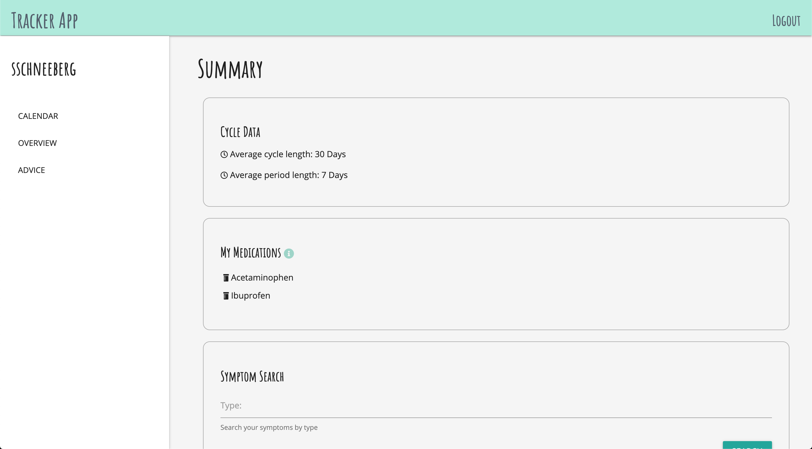

# Tracker App

A neutral period tracker app, focusing on record keeping and prediction rather than pregnancy and fertility.

## User Stories

As a user, I want to reliably track my period and related information, recording what I deem important.  I want to be able to see my predicted, upcoming start date as well as information regarding my typical cycle.  As a user, I want the ability to compare symptoms across periods and quickly access information from past dates.

## Features

#### Calendar and Day View

The calendar and day views provide the user the ability to view all information recorded in the given date spans (one month or one day), as is usual in most period tracker apps.  These views show either the current day of your recorded period or your upcoming start date.

#### Overview/User Data Summary

This feature allows the user to see their cycle data, which is typically found in period tracker apps (such as cycle and period length).  Unlike a normal tracker, this also allows the user to search past dates for quick access.  There is aslo the ability to search by symptom and compare across your historical data.  This is a feature, I personally wanted in my period tracker; I consistently find myself wondering if I'm experiencing the same things as before.  This offers an easier way to see these as trends rather than just going back to the previous cycle in a calendar view.

It is a future goal to include graphs of cycle length changes and symptom reccurrence to provide a better overview of the period data to users.

#### Medical Advice

The inclusion of a medical API allows the user to search for medication they may be taking or may want to take to alleviate their period symptoms and view active ingredients.  The user can also mark medication they take or have taken to view a running list of what works for them.  

I hope to soon include a second API which will allow users to search their symptoms and recieve a brief diagnosis.  Sometimes an out of the ordinary symptom can feel like there may be something other than your hormones to blame.  This would provide a localized place to check if what your are experiencing is normal.

#### Future Goal: Friendly Advice

Friends are often the best source of advice for dealing with period symptoms, but sometimes breaching the conversation can be awkward and uncomfortable.  I want to include the ability to connect with your friends on this app to provide a safe space to ask questions and seek advice from those you trust.

## To use visit the [Tracker App](https://periodtrackerapp.herokuapp.com/) site

## To Install:

####  Set up file structure and dependencies
1. Fork and Clone this directory to your local machine
2. Run `npm install` to grab the proper dependencies
3. Set up your `.env` file with a secret session key and an (option) port number

#### Set up Database
1. Run `sequelize db:create trackerapp_development` to set up the proper database in Postgres
2. Migrate the models using `sequelize db:migrate`
3. If desired, seed the database with the example user with `sequelize db:seed:all`

    *The log on credentials can be found in the seeder file*
4. Check that your migrations ran properly by connecting to the database in after opening psql terminal, and/or run the dbTest.js file with `node dbTest.js` after uncommenting the Sequelize database calls

#### Run Locally
1. Connect to `localhost:<PORT>` in browser to run the app

## Dependencies

* Database creation/access: Sequelize, Sequelize CLI, pg
* Authentication, protection, and connection: Passport, Passport Local, bcrypt, Connect Flash, Express, Dotenv
* Layout, Views, and Routing: Express, EJS, EJS Layouts, Method Override, Morgan
* API access: Axios
* Date management: Moment

## Models

Current Database Schema

Stretch Goal Schema

## Routes

| Method | Path | Location | Purpose |
| ------ | ---------------- | -------------- | ------------------- |
| GET | / | server.js | Landing page |
| GET | /auth/login | auth.js | Login form |
| GET | /auth/signup | auth.js | Signup form |
| POST | /auth/login | auth.js | Login user |
| POST | /auth/signup | auth.js | Create User |
| GET | /auth/logout | auth.js | Remove session info |
| GET | /user/:month | user.js | User home, Show calendar view |
| GET | /user/:month/:day | user.js | Day view, show all records for date, allow note editing |
| GET | /user/:month/:day/new | user.js | Add records for date |
| POST | /user/:month/:day/period | user.js | Add period start or end for user for date |
| POST | /user/:month/:day/note | user.js | Add ntoe for user for date |
| POST | /user/:month/:day/activity | user.js | Add sexual activity record for user for date |
| POST | /user/:month/:day/symptom | user.js | Add symptom record for user for date |
| POST | /meds | user.js | Add medication record for user |
| PUT | /user/:month/:day/:id | user.js | Update edited note |
| DELETE | //user/:month/:day/:id | user.js | Delete note|
| GET | /summary | user.js | Show overview of user information, allow user to search records |
| GET | /summary/symptoms | user.js | Show symtpom search results |
| GET | /summary/date | user.js | Redirect to /user/:month/:day based on search |
| GET | /advice | user.js | Access medical advice through API |
| GET | /advice/results | user.js | Show API search resutls |
| GET | * | user.js, auth.js, server.js | Catch errors in path |

## Styling and Responsiveness

For the most part, styling and responsiveness is employ utilizing the **Materialize CSS** framework with personal tweaks as necessary. The calendar layout is created with CSS grid and is made to be responsive utilizing `@media` queries.  As the intent of this app is to be nuetral and inclusive, the default body font was chosen after researching dyslexia friendly fonts.

#### Landing Page

#### User Home

#### Day View

#### Adding and Editing Records

#### Data Overview

#### Medical Advice Search

#### Responsiveness

